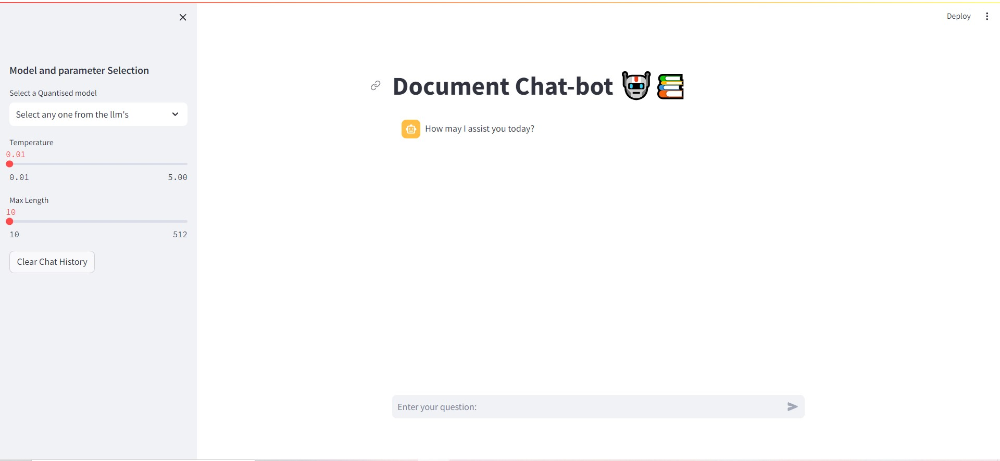

# Local-PDF_Chatbot-using-LLM (Using FAISS)

This application is tested on PDF documents which can be ingested and necessary answers can be seen when a local Large Language Model (LLM) is loaded onto main memory. This is my first project on Prompt Engineering. 
This includes an ingestion based file to convert documents to vector embedded chunks, a model mapping file which loads the LLMs using CTransformers library running under 'CPU' mode and the main file - chat.py which includes a streamlit application where the application is run locally after calling in terminal from VSCode.

The application's running device is "CPU", so the llm infernece would be more and response would be generated according your RAM (min. 16GB).

# Installation 

Create a new anaconda environment of the name you want to give. Then,refer to the file named pipinstalls.txt to follow the pip installs the modules you can also see the llm models link, copy paste the link on search bar and download files.

You can also use the file "requirements_ver.txt" after referring to this vid- https://youtu.be/Tu_HcflONZM?si=ri8zHQ6mrCP31TE-

# Steps for installation

i) git clone https://github.com/mr-nobody15/Local_LLM-Chatbot.git.
ii) cd Local-PDF_Chatbot (Using FAISS), (You can also use cd L then press Tab which automatically folder name is seen).
iii) Download the LLM's from Hugging Face using link https://huggingface.co/models.
iv) Put Necessary documents under Documents Folder.
v) Run command:

pip install <all_modules in pipinstalls.txt> or pip install -r requirements.txt
python ingest.py
streamlit run chat.py

# Documents Folder

In this folder add necessary PDFs you would like to work with, I have added paper 2 and paper 3 as reference you can check it as test case after cloning repo into local machine.

# Model Folder

For the application we need the local LLMs file under Models folder, download the models from huggingface website using this link https://huggingface.co/models.
The model list is in llm models.txt file

# Run Application

To run the application, use the command line:

"streamlit run chat.py"

# Application page

This is streamlit application in which on the left pane includes the model selection and controlled parameter selection defined under CTransformers library. The main pane includes the chat between the bot and we the users.
To run the application, set the model name and the parameters range, the responses are generated based on the model selection and parameters. For ex: Temperature is preferred to be in the range of 0 to 1.

  

  

# Outputs 

Below output response is given by "mistral-7b-instruct":

  

Below output response is given by "Vicuna-13 5-bit":

  

